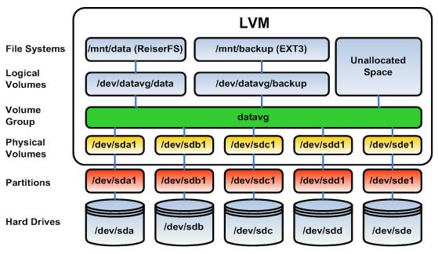

# `lvm` Partition scheme

## lvm objects

| VG                    | hostvg1        | /dev/nvme0n1p3 |
| --------------------- | -------------- | -------------- |
| physical volume       | /dev/nvme0n1p3 |                |
| logical volume - home | home           | 40G            |
| lv                    | root           | 30G            |
| lv                    | swap           | 2G             |
| lv                    | tmp            | 10G            |
| lv                    | var            | 800G           |

## Disk label type: `gpt`

## Linux servers (virtualization/containers) -- to be verified

| Partition                    | Mount point | size                  |
| ---------------------------- | ----------- | --------------------- |
| /dev/nvme0n1p1               | /boot/efi   | 512M. -->536M         |
| /dev/nvme0n1p2               | /boot       | 456M (500M) ---> 512M |
| /dev/mapper/vmhost1--vg-root | /           | 30G                   |
| /dev/mapper/vmhost1--vg-home | /home       | 40G                   |
| /dev/mapper/vmhost1--vg-tmp  | /tmp        | 10G                   |
| /dev/mapper/vmhost1--vg-var  | /var        | 800G                  |
| /dev/mapper/vmhost1--vg-swap | Swap area   | 1G                    |

#lvm
#linux #partition
